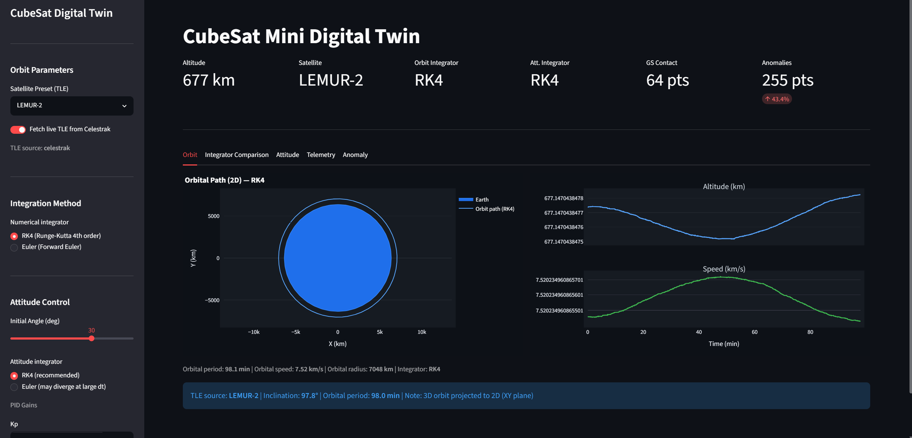
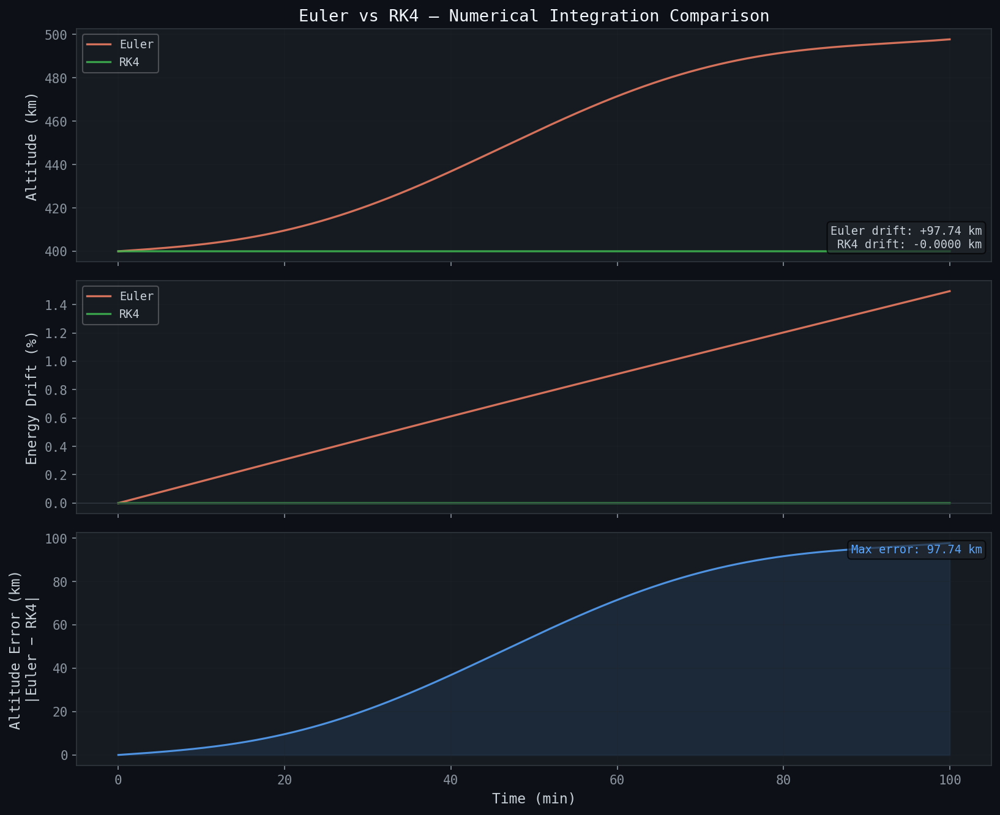
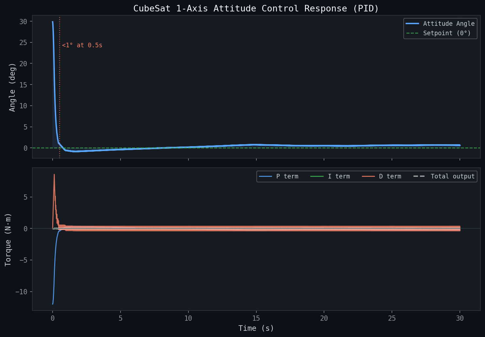

# CubeSat Mini Digital Twin

A personal aerospace software project that simulates a simplified CubeSat system — from orbital mechanics to attitude control, telemetry, and anomaly detection — through an interactive digital twin dashboard.

---

## Overview

This project connects software engineering with aerospace concepts by building a complete simulation pipeline for a small satellite.

The system models:
- 2D orbital dynamics with real TLE data support
- 1-axis attitude control using a PID controller
- Subsystem telemetry (battery, temperature, communication)
- Rule-based anomaly detection
- An interactive Streamlit dashboard

---

## Motivation

I am interested in aerospace software development, particularly in GNC, simulation, and digital twin technologies. Before joining a university lab focused on space mobility and digital twin research, I built this project to understand the basic software architecture of a satellite system from first principles.

The emphasis is on implementing the physics directly rather than relying on high-level libraries — and on understanding the tradeoffs between different numerical methods through hands-on experimentation.

---

## Demo


---

## Results

### Orbit Simulation — Euler vs RK4



Both integrators use identical initial conditions at 400 km LEO. Over a 100-minute simulation:

| Method | Altitude Drift | Energy Drift |
|---|---|---|
| Forward Euler | +97.74 km | +1.49% |
| RK4 | 0.0000 km | 0.000000% |

RK4 eliminates the energy conservation error that causes Forward Euler orbits to spiral outward over time.

### Attitude Control — PID Response


1-axis attitude stabilization from 30° to 0° using a PID controller:

| Parameter | Value |
|---|---|
| Initial angle | 30° |
| Convergence to ±1° | 0.48 s |
| Convergence to ±0.1° | 0.59 s |
| PID gains | Kp=0.4, Ki=0.005, Kd=0.05 |
| Max torque | ±0.05 N·m |

---

## Features

### Orbit Simulation
- 2D Keplerian orbit propagation using Newtonian gravity
- Two numerical integrators: Forward Euler and Runge-Kutta 4 (RK4)
- Side-by-side integrator comparison with altitude drift and energy conservation metrics
- Real TLE data support via Celestrak API (ISS, DOVE-1, LEMUR-2, or any NORAD ID)
- Graceful offline fallback when network is unavailable

### Attitude Control
- 1-axis rigid body rotation dynamics (τ = Iα)
- Discrete-time PID controller with anti-windup and output limiting
- Both Euler and RK4 integration for the attitude dynamics
- Disturbance torque modeling (Gaussian noise)

### Telemetry Generation
- Downsampled telemetry from orbit and attitude simulation results
- Battery model: energy balance (solar generation vs. consumption)
- Temperature model: exponential moving average between sunlit/eclipse states
- Ground contact model: orbital angle-based communication windows

### Anomaly Detection
- Rule-based threshold detection for battery, temperature, altitude, and attitude
- Z-score statistical detection for unexpected deviations
- Battery discharge trend analysis (consecutive drop detection)

### Streamlit Dashboard
- Live parameter control: altitude, simulation duration, PID gains
- Integrator selector for both orbit (RK4/Euler) and attitude (RK4/Euler)
- TLE satellite presets with live Celestrak fetch toggle
- 5 tabs: Orbit, Integrator Comparison, Attitude, Telemetry, Anomaly

---

## Tech Stack

- **Python 3.9+**
- `numpy` — numerical simulation
- `pandas` — telemetry data processing
- `matplotlib` — result plots
- `streamlit`, `plotly` — interactive dashboard
- `sgp4` — TLE parsing and SGP4 orbit propagation

---

## Project Structure

```
cubesat-mini-digital-twin/
│
├── README.md
├── requirements.txt
├── main.py
│
├── src/
│   ├── orbit/
│   │   ├── orbital_constants.py      # Physical constants (μ, R_earth)
│   │   ├── orbit_simulator.py        # Euler + RK4 orbit propagation
│   │   ├── tle_loader.py             # TLE parsing, 3D→2D projection
│   │   └── tle_fetcher.py            # Live TLE fetch from Celestrak
│   │
│   ├── attitude/
│   │   ├── attitude_model.py         # 1-axis rigid body dynamics
│   │   └── pid_controller.py         # Discrete PID with anti-windup
│   │
│   ├── telemetry/
│   │   ├── telemetry_generator.py    # Subsystem telemetry generation
│   │   └── anomaly_detector.py       # Rule-based + Z-score detection
│   │
│   ├── dashboard/
│   │   └── app.py                    # Streamlit dashboard
│   │
│   └── utils/
│       └── plot_utils.py             # Matplotlib result plots
│
├── data/
│   └── sample_telemetry.csv
│
├── results/
│   ├── orbit_plot.png
│   ├── altitude_plot.png
│   ├── speed_plot.png
│   ├── euler_vs_rk4.png
│   ├── attitude_response.png
│   └── dashboard_screenshot.png
│
└── docs/
    └── project_report.md
```

---

## Getting Started

```bash
# 1. Clone the repository
git clone https://github.com/yumina0616/cubesat-mini-digital-twin.git
cd cubesat-mini-digital-twin

# 2. Create virtual environment
python -m venv venv
source venv/bin/activate        # macOS/Linux
# Windows (PowerShell): .\venv\Scripts\Activate.ps1
# Windows (cmd):        venv\Scripts\activate

# 3. Install dependencies
pip install -r requirements.txt

# 4. Run simulation and generate result plots
python main.py

# 5. Launch dashboard
streamlit run src/dashboard/app.py
```

---

## Physics Background

### Orbital Mechanics

The orbit is propagated by integrating Newton's law of gravitation:

```
a = -μ · r / |r|³
```

where `μ = GM_earth = 3.986 × 10¹⁴ m³/s²`.

Forward Euler updates the state each timestep as:

```
r(t+dt) = r(t) + v(t) · dt
v(t+dt) = v(t) + a(t) · dt
```

RK4 evaluates the derivative four times per step and takes a weighted average, reducing the local truncation error from O(dt²) to O(dt⁵). This is why Euler drifts ~98 km over 100 minutes while RK4 shows no measurable drift.

### Attitude Dynamics

Single-axis rotation follows the rotational form of Newton's second law:

```
α = τ / I
```

where `τ` is the control torque (N·m) and `I` is the moment of inertia (kg·m²). The PID controller computes `τ` each timestep to minimize the error between the current and target attitude angle.

### TLE Integration

Real satellite TLEs are fetched from [Celestrak](https://celestrak.org) using the GP API:

```
https://celestrak.org/NORAD/elements/gp.php?CATNR=<NORAD_ID>&FORMAT=TLE
```

The 3D ECI position and velocity are projected onto the 2D XY plane while preserving the orbital radius and speed magnitude. The orbital angular momentum Z-component determines the direction of revolution.

---

## Limitations

- **2D only**: The orbit is projected onto the equatorial plane. Inclination effects are not modeled.
- **1-axis attitude**: Full 3-axis control would require quaternion-based dynamics.
- **Simplified subsystems**: Battery, temperature, and communication models are approximations for visualization purposes.
- **Forward Euler (option)**: Retained for educational comparison with RK4.

---

## Future Improvements

- 3-axis attitude control with quaternion representation
- Kalman Filter-based state estimation
- More realistic perturbation models (J2, drag, solar radiation pressure)
- Arduino + MPU-6050 hardware-in-the-loop integration
- Ground station visibility analysis

---

## Purpose

This project is not intended to be a production-grade satellite simulator. It is a learning project that connects software engineering with aerospace concepts — built to understand how simulation, control, telemetry, and monitoring systems fit together in a real-world context.